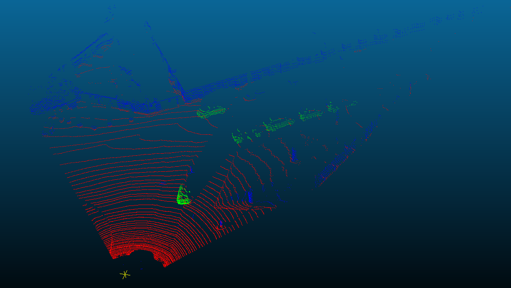
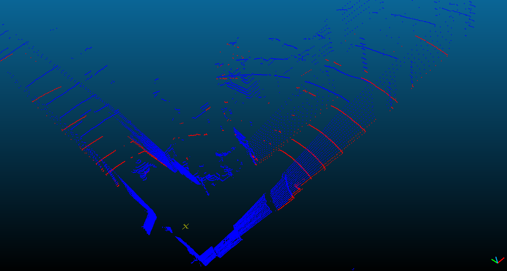
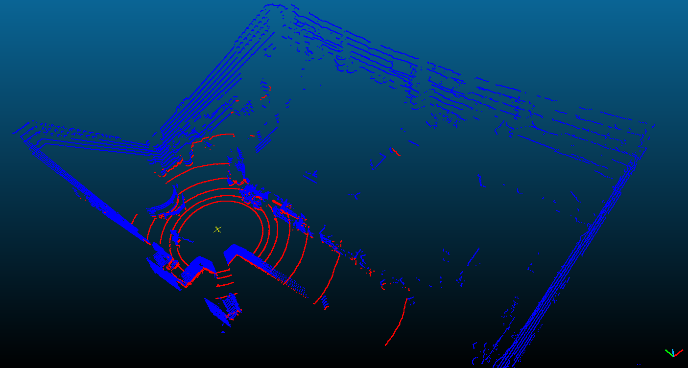
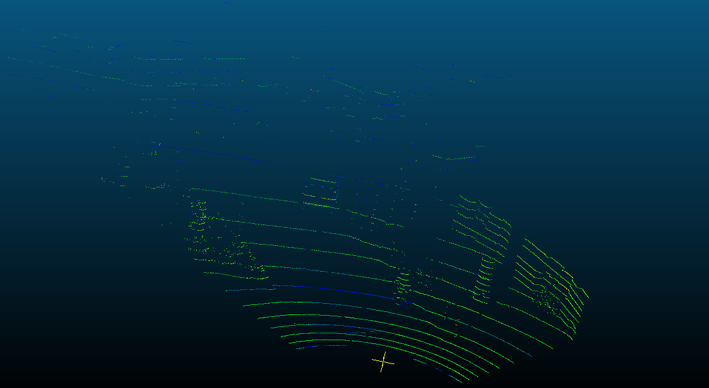
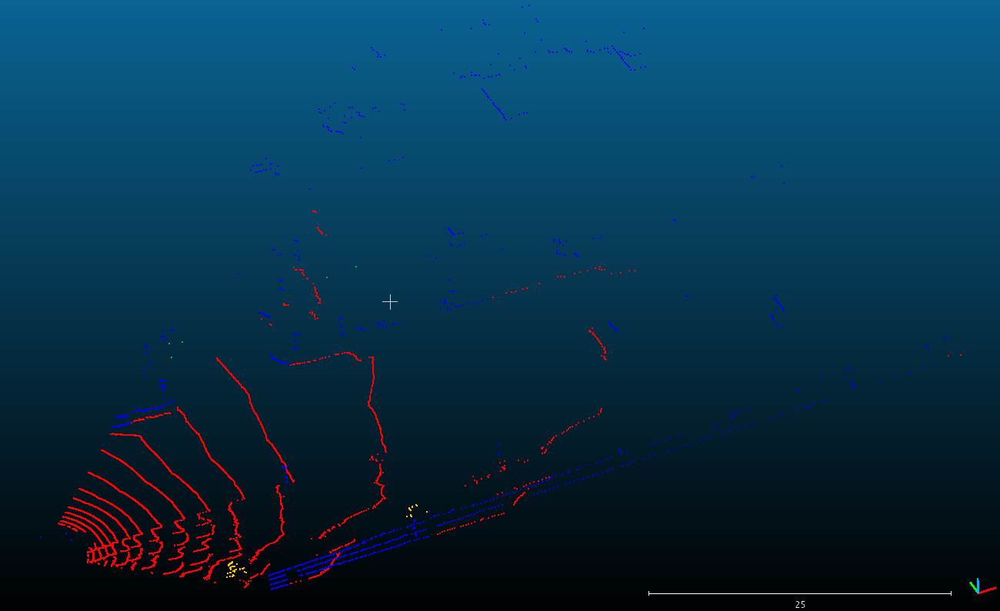

# Semantic Segmentation of Sparse Point Clouds using SqueezeSeg - RISS 2018

This repository contains:
- A C++ ground annotator of point clouds based on: 
	Fast segmentation of 3D point clouds: a paradigm on LIDAR data 
	By Dimitris Zermas Izzat Izzat and Nikolas Papanikolopoulos
```
@inproceedings{7989591, 
	author={D. Zermas and I. Izzat and N. Papanikolopoulos}, 
	booktitle={2017 IEEE International Conference on Robotics and Automation (ICRA)}, 
	title={Fast segmentation of 3D point clouds: A paradigm on LiDAR data for autonomous vehicle applications}, 
	year={2017}, 
	pages={5067-5073}, 
	doi={10.1109/ICRA.2017.7989591}, 
	ISSN={}, 
	month={May}
}

```
- Data downsampler to simulate VLP16 LIDAR scans from VLP64.
- Data upsampler to simulate VLP32 LIDAR scans from VLP16. 

These scans were obtained from:
	Squeezeseg: Convolutional neural nets with recurrent crf for real-time road-object segmentation from 3d lidar point cloud
	By Bichen Wu, Alvin Wan, Xiangyu Yue, Kurt Keutzer
	[SqueezeSeg](https://github.com/BichenWuUCB/SqueezeSeg) 
```
@article{wu2017squeezeseg,
    title={Squeezeseg: Convolutional neural nets with recurrent crf for real-time road-object segmentation from 3d lidar point cloud},
    author={Wu, Bichen and Wan, Alvin and Yue, Xiangyu and Keutzer, Kurt},
    journal={arXiv preprint arXiv:1710.07368},
    year={2017}
}
```
## Prerequisites

```
For the ground extraction algorithm (C++)
- Eigen3
- Boost
For the downsampler / upsampler converter (Python)
- Python 2.7
```

## Process (example)

### 1. Convert .npy data to .txt
The ground annotation tool is implemented in c++ and currently it only takes text files as input, so it is necessary to convert the SqueezeSeg data which is in .npy format. 

To do so, run:
```
cd $SPARSEG_ROOT/
python scripts/convert.py --inpath data/sample/squeeze/ --outpath data/sample/ --outdir textfiles --conv txt
```
It should create a folder called ```textfiles_v1``` in ```data/sample/``` where the converted point clouds are saved. 

### 2. Annotate ground 

Compile

```
mkdir & cd build
cmake ..
make 
```

To test if it works, run the following command:
```
cd $SPARSEG_ROOT/build
./extractGround
```
It should create a folder called ```g_textfiles1_1``` in ```./data/sample/``` where it will save the annotated point clouds. The 'g' means that the files in the folder have been annotated. 

Modifying parameters:
```
cd $SPARSEG_ROOT/build
./extractGround --inpath ../data/sample/textfiles_v1 --outpath ../data/sample/ --seg 4 --lpr 20 --iter 3 --thseed 0.8 --thdist 0.5 --method 0
```
Those are my prefered parameter values. However, if not modified, it will use the default values based on the original implementation. Check either the paper or the code to see what each parameter does. 

#### Some results
Tested on a pointcloud with 64 scanlines (obtained from the KITTI dataset): 
<p align="center">
    
  </p>
Tested on a pointclouds with 16 scanlines 
<p align="center">
    
  </p>
<p align="center">
    
  </p>

### 3. Convert .txt data to .npy 
After annotating the point clouds it is necessary to convert them back to the SqueezeSeg format (.npy) to train the network. 

To do so, run:
```
cd $SPARSEG_ROOT/
python scripts/convert.py --inpath data/sample/g_textfiles1_1/ --outpath data/sample/ --outdir g_squeeze --conv npy
```
It should create a folder called ```g_squeeze1``` in ```./data/sample/``` where it will save the converted files in the SqueezeSeg format. 

### 4. Downsample data (pipeline 1)
The original point clouds from the SqueezeSeg approach were recorded using a Velodyne 64. The downsampler creates a point cloud scan with 16 and 32 rings based on the scans with 64 rings. 

To downsample the point cloud, run:
```
cd $SPARSEG_ROOT/
python scripts/convert.py --inpath data/sample/g_squeeze1/ --outpath data/sample/ --outdir downsampled --conv down
```
It should create a folder called ```downsampler``` in ```./data/sample/``` with 4 subdirectories: 3 that represen 16-ring scans and 1 that represent the 32-ring scans. 

#### Some results
Original 64-ring scan:
<p align="center">
    
  </p>
Downsampled 16-ring scan:
<p align="center">
    
  </p>

### 5. Upsample data (pipeline 2)
The upsampler creates a 32-ring scan based on a 16-ring scan. 

To upsample the point cloud, run: 
```
cd $SPARSEG_ROOT/
python scripts/convert.py --inpath data/sample/downsampled/vlp16m1/ --outpath data/sample/ --outdir upsampled --conv up
```

#### Some results
Original 16-ring scan:
<p align="center">
    
  </p>

Upsampled 32-ring scan:
<p align="center">
    
  </p>


It should create a folder called ```upsample1``` in ```./data/sample/``` where the 32-ring point clouds are saved. 

### NOTE
More details about the pipelines can be found on my modified version of SqueezeSeg [MySqueezeSeg](https://github.com/IngridNavarroA/SqueezeSeg). 

## TO DO:
- [ ] Python version of the ground annotation algorithm 
- [ ] Upsample to 64-ring scans

